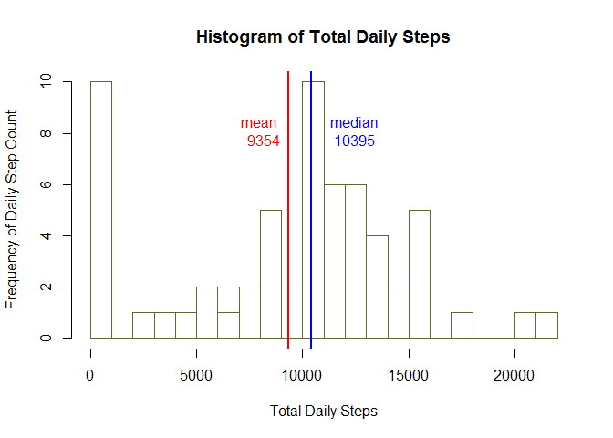
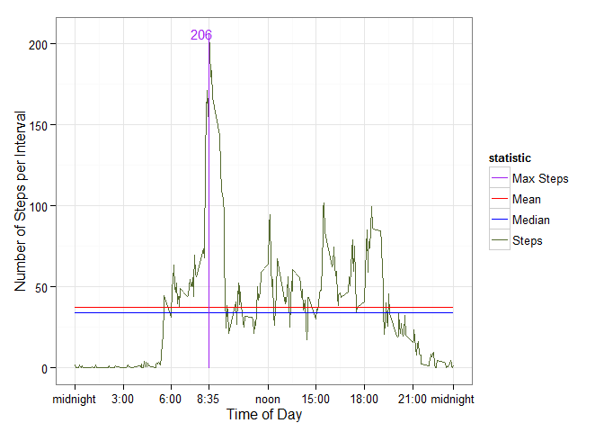
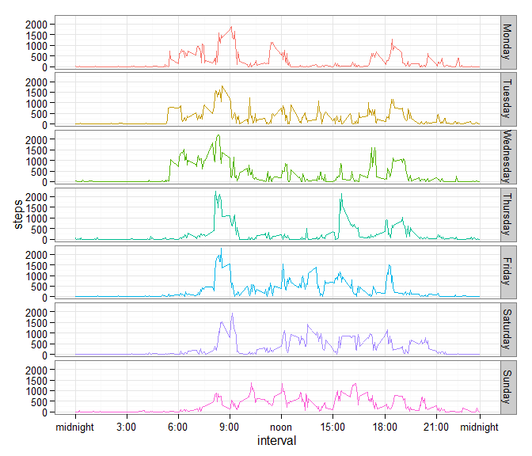
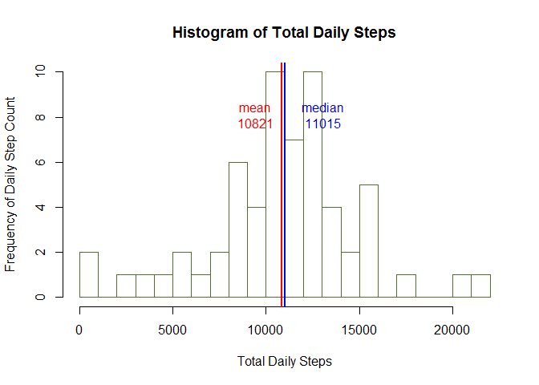
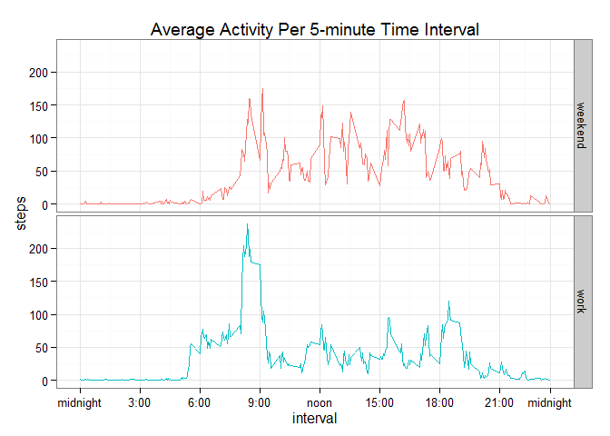

# Reproducible Research: Peer Assessment 1

##Libraries
Load all the libraries we'll be using: 


* knitr  
* dplyr 
* tidyr  
* ggplot2  
* reshape2  
* data.table  
* stringi  
* xtable


##Loading a Processing the Data

### About the initial data set

* Dataset: [Activity monitoring data](https://d396qusza40orc.cloudfront.net/repdata%2Fdata%2Factivity.zip) [52K]

The variables included in this dataset are:

* **steps**: Number of steps taking in a 5-minute interval (missing
    values are coded as `NA`)

* **date**: The date on which the measurement was taken in YYYY-MM-DD
    format

* **interval**: Identifier for the 5-minute interval in which
    measurement was taken


The dataset is stored in a comma-separated-value (CSV) file and there are a total of 17,568 observations in this
dataset.

###Download the data

Check to see if the file is already downloaded and unzipped.  If not, fetch it from its URL  

```r
if (!file.exists ("activity.zip") ){download.file("https://d396qusza40orc.cloudfront.net/repdata%2Fdata%2Factivity.zip", "activity.zip")
}

if(!file.exists("activity.csv")){unzip("activity.zip")}
```
###Read the data

Read the data into a master data frame variable **activity.** 
We'll create temporary data frames based on the initial data set.


```r
activity<-read.csv("activity.csv", stringsAsFactors = FALSE, na.strings = c("NA",""))
str(activity)
```

```
## 'data.frame':	17568 obs. of  3 variables:
##  $ steps   : int  NA NA NA NA NA NA NA NA NA NA ...
##  $ date    : chr  "2012-10-01" "2012-10-01" "2012-10-01" "2012-10-01" ...
##  $ interval: int  0 5 10 15 20 25 30 35 40 45 ...
```

```r
summary(activity)
```

```
##      steps            date              interval     
##  Min.   :  0.00   Length:17568       Min.   :   0.0  
##  1st Qu.:  0.00   Class :character   1st Qu.: 588.8  
##  Median :  0.00   Mode  :character   Median :1177.5  
##  Mean   : 37.38                      Mean   :1177.5  
##  3rd Qu.: 12.00                      3rd Qu.:1766.2  
##  Max.   :806.00                      Max.   :2355.0  
##  NA's   :2304
```

For some explorations of this data, we will need to know which day of the week each record comes from as well as whether or not that day is a weekday or weekend.

Create additional variables:

* **weekdays**: Factor Days of the week as string.  This variable is calculated from the date variable. created with seven levels and classed "Monday" through "Sunday" so that they will order by day-of-week rather than the default alphabetical order. 

* **workday**: Factor with two levels, calculated from the newly created weekday variable.  
        0: weekend  
        1: weekday


```r
activity<-mutate(.data = activity, date=as.Date(date), interval=as.numeric(interval), 
             weekdays=factor(weekdays.Date(date),levels = c("Monday", "Tuesday", "Wednesday", "Thursday", "Friday", "Saturday", "Sunday")), 
             workday=factor(ifelse(weekdays=="Saturday"|weekdays=="Sunday", 0, 1),levels = c(0, 1)))
```


```r
str(activity)
```

```
## 'data.frame':	17568 obs. of  5 variables:
##  $ steps   : int  NA NA NA NA NA NA NA NA NA NA ...
##  $ date    : Date, format: "2012-10-01" "2012-10-01" ...
##  $ interval: num  0 5 10 15 20 25 30 35 40 45 ...
##  $ weekdays: Factor w/ 7 levels "Monday","Tuesday",..: 1 1 1 1 1 1 1 1 1 1 ...
##  $ workday : Factor w/ 2 levels "0","1": 2 2 2 2 2 2 2 2 2 2 ...
```


```r
summary(activity)
```

```
##      steps             date               interval           weekdays   
##  Min.   :  0.00   Min.   :2012-10-01   Min.   :   0.0   Monday   :2592  
##  1st Qu.:  0.00   1st Qu.:2012-10-16   1st Qu.: 588.8   Tuesday  :2592  
##  Median :  0.00   Median :2012-10-31   Median :1177.5   Wednesday:2592  
##  Mean   : 37.38   Mean   :2012-10-31   Mean   :1177.5   Thursday :2592  
##  3rd Qu.: 12.00   3rd Qu.:2012-11-15   3rd Qu.:1766.2   Friday   :2592  
##  Max.   :806.00   Max.   :2012-11-30   Max.   :2355.0   Saturday :2304  
##  NA's   :2304                                           Sunday   :2304  
##  workday  
##  0: 4608  
##  1:12960  
##           
##           
##           
##           
## 
```


There are quite a few rows with missing data, 2304 to be exact!

## What is mean total number of steps taken per day?

Using the *dplyr* package, group and summarize the data by date and assign to a new data frame called **totalsteps**

In this first exploration, we'll leave out missing values from the calculation of mean and median.

Calculate mean steps, store in variable *meansteps.* 
Calculate median steps, store in variable *mediansteps*  


```r
totalsteps<-activity
totalsteps<-select(.data = totalsteps, date, steps)%>%
        group_by(date)%>%
        summarise(dailysteps=sum(steps, na.rm=T))%>%
        as.data.frame()

meansteps<-mean(totalsteps$dailysteps, na.rm=T)
mediansteps<-median(totalsteps$dailysteps, na.rm=T)
```

Generate a histogram of **totalsteps** with 20 breaks using the base graphic package with a mean line in red and a median line in blue


```r
hist(totalsteps$dailysteps, breaks=20, xlab="Total Daily Steps", ylab="Frequency of Daily Step Count", main = "Histogram of Total Daily Steps", border = "darkolivegreen")
abline(v=meansteps, col="red", lwd=2)
abline(v=mediansteps, col="blue", lwd=2)
text(labels = paste("mean", "\n", as.integer(meansteps), collapse = "\n"), x=meansteps, y=8, pos=2, col="red")
text(labels = paste("median", "\n", mediansteps, collapse = "\n"), x=mediansteps+500, y=8, pos=4, col="blue")
```

 

## What is the average daily activity pattern?
Since the individual dates don't matter for this question, we'll create a data frame **dailypattern** from **activity** subsetting only the *interval* and *steps* columns.

We'll create **hurry** to hold the maximimum value and its corresponding interval.


```r
dailypattern<-select(activity, interval, steps)%>%
        group_by(interval)%>%
        summarise(avgsteps=mean(steps, na.rm=TRUE))%>%
        as.data.frame()

summary1<-summary(dailypattern$avgsteps)

dailymean<-as.integer(mean(dailypattern$avgsteps, na.rm = T))
dailymedian<-median(dailypattern$avgsteps, na.rm = T)
        
dailypattern<-mutate(dailypattern, avgsteps=avgsteps, mean=mean(avgsteps, na.rm=T), median=median(avgsteps, na.rm=T))#add columns for mean and median this will facilitate creating the chart.

dailypattern<-gather(dailypattern, "statistic", "value", 2:4) #all three value columns into one column

dailypattern$statistic<-factor(dailypattern$statistic, levels=c("avgsteps", "mean", "median"), labels=c("Steps", "Mean", "Median")) #class the gathered column as factor with three levels.  Relabel the levels to be more human-friendly.

hurry<-dailypattern[which(dailypattern$value==max(dailypattern$value)), c("interval", "value")]#find the interval with the maximum value.
```

The interval with the maximum mean steps is:

```
## [1] 835
```
Which corresponds to 8:35 a.m.

NOTE: I have used the *scale_x_continuous()* function to replace the original x-axis which was a series of integers with their corresponding clock time (24 hr).  This makes it easier to read the day.


```r
#I decided to get fancy and figure out a way to convert the three digit interval to a time formatted string.

beg<-stri_sub(str=hurry$interval, from = stri_length(hurry$interval)-2, to =1 )
endtime<-stri_sub(str=hurry$interval,from = stri_length(hurry$interval)-1, to=stri_length(hurry$interval) )
hurrytime<-paste(beg, endtime, sep = ":")

ggplot(dailypattern, aes(x=interval, y=value, group=statistic, col=statistic))+
        ylab("Number of Steps per Interval")+
        xlab("Time of Day")+
        geom_line()+
        geom_line(aes(x=hurry$interval, col=factor(x = hurry$interval,labels = "Max Steps")))+
        annotate("text", x=hurry$interval-50, y=hurry$value, label=as.integer(hurry$value), col="purple", cex=4)+
        scale_color_manual(values=c("purple", "red", "blue","darkolivegreen"))+
        scale_x_continuous(breaks = c(0, 300, 600, hurry$interval, 1200, 1500, 1800, 2100, 2355 ), labels=c("midnight","3:00", "6:00", hurrytime, "noon", "15:00", "18:00", "21:00", "midnight"))+
        theme_bw()
```

 


## Imputing missing values

```r
miss<-nrow(activity[is.na(activity$steps),])
tot<-nrow(activity)
pct<-(miss/tot)*100
```

As noted earlier, there are quite a few missing values. In fact, there are a total of  2304 records with missing step data.  This is  13.1147541 % or nearly 1 in 7.

Is it enough to simply use the mean of each interval, or should we use the mean of each interval *per day*?

We've already seen the what an average day looks like (above), let's compare averages per weekday to see if any patterns emerge.


```r
intervalpattern<-select(activity, weekdays, interval, steps)%>%
        group_by(weekdays, interval)%>%
        summarise(steps = sum(steps, na.rm=TRUE))%>%
        as.data.frame()

ggplot(intervalpattern, aes(x=interval, y=steps, group=weekdays, fill=weekdays, col=weekdays) )+
        geom_line()+
        facet_grid(weekdays~.)+
scale_x_continuous(breaks = c(0, 300, 600, 900, 1200, 1500, 1800, 2100, 2355 ), labels=c("midnight","3:00", "6:00", "9:00", "noon", "15:00", "18:00", "21:00", "midnight"))+
       theme_bw()+
        theme(legend.position="none")
```

 

There does appear to be a difference in the activity patterns per weekday.

It's notable that Monday-Wednesday have similar shapes, as do Thursday-Saturday.  Sunday has a "smoother" profile lacking the extreme spikes of activity that we see on the other six days.

Because of these daily differences, we'll impute the missing data with the mean of *interveral* per *weekday*.

Create a data frame called **missing** by selecting the *weekdays*, *interval* and *steps* columns from the **activity** data frame.

Take the mean of each interval per weekday.  This should produce 2016 objects (288 intervals X 7 days).


```r
missing<-select(activity,  weekdays, interval, steps)%>%
        group_by(weekdays, interval)%>%
        summarise(msteps=mean(steps, na.rm=T))%>%
        as.data.frame()

str(missing)
```

```
## 'data.frame':	2016 obs. of  3 variables:
##  $ weekdays: Factor w/ 7 levels "Monday","Tuesday",..: 1 1 1 1 1 1 1 1 1 1 ...
##  $ interval: num  0 5 10 15 20 25 30 35 40 45 ...
##  $ msteps  : num  1.43 0 0 0 0 ...
```

create a new data frame from the activity data set and call it **completesteps**.

Left-join a column to add the mean steps per interval per day as *msteps*.


```r
completesteps<-activity
completesteps<-left_join(x = completesteps, y=missing, by=c("weekdays", "interval"))
str(completesteps)
```

```
## 'data.frame':	17568 obs. of  6 variables:
##  $ steps   : int  NA NA NA NA NA NA NA NA NA NA ...
##  $ date    : Date, format: "2012-10-01" "2012-10-01" ...
##  $ interval: num  0 5 10 15 20 25 30 35 40 45 ...
##  $ weekdays: Factor w/ 7 levels "Monday","Tuesday",..: 1 1 1 1 1 1 1 1 1 1 ...
##  $ workday : Factor w/ 2 levels "0","1": 2 2 2 2 2 2 2 2 2 2 ...
##  $ msteps  : num  1.43 0 0 0 0 ...
```

Find the records that have missing data and substitute in the value from msteps.


```r
completesteps$steps<-ifelse(!is.na(completesteps$steps), completesteps$steps, completesteps$msteps)

newsteps<-select(.data = completesteps, date, steps)%>%
        group_by(date)%>%
        summarise(dailysteps=sum(steps, na.rm=T))%>%
        as.data.frame()

newmeansteps<-mean(newsteps$dailysteps, na.rm=T)
newmediansteps<-median(newsteps$dailysteps, na.rm=T)
```
Use str() to check the original table **activity** and the imputed data **compltesteps.** They should have the same number of objects.  We also need to check that the original non-missing data did not get overwritten:

```r
summary(activity)
```

```
##      steps             date               interval           weekdays   
##  Min.   :  0.00   Min.   :2012-10-01   Min.   :   0.0   Monday   :2592  
##  1st Qu.:  0.00   1st Qu.:2012-10-16   1st Qu.: 588.8   Tuesday  :2592  
##  Median :  0.00   Median :2012-10-31   Median :1177.5   Wednesday:2592  
##  Mean   : 37.38   Mean   :2012-10-31   Mean   :1177.5   Thursday :2592  
##  3rd Qu.: 12.00   3rd Qu.:2012-11-15   3rd Qu.:1766.2   Friday   :2592  
##  Max.   :806.00   Max.   :2012-11-30   Max.   :2355.0   Saturday :2304  
##  NA's   :2304                                           Sunday   :2304  
##  workday  
##  0: 4608  
##  1:12960  
##           
##           
##           
##           
## 
```

```r
summary(completesteps)
```

```
##      steps             date               interval           weekdays   
##  Min.   :  0.00   Min.   :2012-10-01   Min.   :   0.0   Monday   :2592  
##  1st Qu.:  0.00   1st Qu.:2012-10-16   1st Qu.: 588.8   Tuesday  :2592  
##  Median :  0.00   Median :2012-10-31   Median :1177.5   Wednesday:2592  
##  Mean   : 37.57   Mean   :2012-10-31   Mean   :1177.5   Thursday :2592  
##  3rd Qu.: 19.04   3rd Qu.:2012-11-15   3rd Qu.:1766.2   Friday   :2592  
##  Max.   :806.00   Max.   :2012-11-30   Max.   :2355.0   Saturday :2304  
##                                                         Sunday   :2304  
##  workday       msteps      
##  0: 4608   Min.   :  0.00  
##  1:12960   1st Qu.:  0.00  
##            Median : 12.57  
##            Mean   : 37.57  
##            3rd Qu.: 55.43  
##            Max.   :328.57  
## 
```

We can look at the **completesteps** table to see if there are any rows that don't have matching data in both the *steps* and *msteps* column.

In fact we can see that the first ten rows, which were originally NA, now have numeric data. To compare where data already


```r
kable(completesteps[c(1:10, 1920:1930), c(1,6,2:5)], digits=2)
```

         steps   msteps  date          interval  weekdays   workday 
-----  -------  -------  -----------  ---------  ---------  --------
1         1.43     1.43  2012-10-01           0  Monday     1       
2         0.00     0.00  2012-10-01           5  Monday     1       
3         0.00     0.00  2012-10-01          10  Monday     1       
4         0.00     0.00  2012-10-01          15  Monday     1       
5         0.00     0.00  2012-10-01          20  Monday     1       
6         5.00     5.00  2012-10-01          25  Monday     1       
7         0.00     0.00  2012-10-01          30  Monday     1       
8         0.00     0.00  2012-10-01          35  Monday     1       
9         0.00     0.00  2012-10-01          40  Monday     1       
10        0.00     0.00  2012-10-01          45  Monday     1       
1920      0.00   131.29  2012-10-07        1555  Sunday     0       
1921      0.00    98.71  2012-10-07        1600  Sunday     0       
1922      0.00   136.43  2012-10-07        1605  Sunday     0       
1923     12.00   152.57  2012-10-07        1610  Sunday     0       
1924     25.00   180.00  2012-10-07        1615  Sunday     0       
1925     30.00   182.29  2012-10-07        1620  Sunday     0       
1926     50.00   190.29  2012-10-07        1625  Sunday     0       
1927      0.00   188.43  2012-10-07        1630  Sunday     0       
1928     83.00   159.29  2012-10-07        1635  Sunday     0       
1929     13.00   114.29  2012-10-07        1640  Sunday     0       
1930    146.00    45.00  2012-10-07        1645  Sunday     0       


```r
hist(newsteps$dailysteps, breaks=20, xlab="Total Daily Steps", ylab="Frequency of Daily Step Count", main = "Histogram of Total Daily Steps", border = "darkolivegreen")
abline(v=newmeansteps, col="red", lwd=2)
abline(v=newmediansteps, col="blue", lwd=2)
text(labels = paste("mean", "\n", as.integer(newmeansteps), collapse = "\n"), x=newmeansteps, y=8, pos=2, col="red")
text(labels = paste("median", "\n", newmediansteps, collapse = "\n"), x=newmediansteps+500, y=8, pos=4, col="blue")
```

 

Compare means and medians before and after imputing missing data


```r
ba<-data.frame(mean=c(meansteps, newmeansteps), median=c(mediansteps,newmediansteps))
rownames(ba)<-c("before", "after")
ba
```

```
##            mean median
## before  9354.23  10395
## after  10821.21  11015
```


## Are there differences in activity patterns between weekdays and weekends?

Using our new, complete data set, we create our final data set by first subsetting **completedata** into two new datasets, **workweek** and **weekend**.


workweek is extracted by filting in rows where *workday* == 1, adding the column *day* and filling in with string data, "work"  
        
weekend is extracted by filtering in rows where *workday* ==0, adding a new column *day* and filling in with string data, "weekend"
        
Our final dataset, **week** is creating by rbinding **workweek** and **weekend**


```r
workweek<-select(completesteps, workday, interval, steps)%>%
        filter(workday==1)%>%
        group_by(interval)%>%
        summarise(day="work", steps=mean(steps, na.rm=TRUE))%>%
        as.data.frame()

mworkweek<-mean(workweek$steps)

weekend<-select(completesteps, workday, interval, steps)%>%
        filter(workday==0)%>%
        group_by(interval)%>%
        summarise(day="weekend", steps=mean(steps, na.rm=TRUE))%>%
        as.data.frame()

mweekend<-mean(weekend$steps)

week<-rbind(workweek, weekend)
```
Which days are the busiest it total mean steps?

```r
busydays<-select(completesteps, weekdays, steps)%>%
        group_by(weekdays)%>%
        summarise(steps=sum(steps))%>%
        arrange(desc(steps))%>%
        as.data.frame()
```


```r
kable(busydays, digits=2 )
```


weekdays         steps
----------  ----------
Friday       111237.43
Wednesday    106116.75
Saturday     100283.43
Sunday        98221.71
Monday        89773.71
Tuesday       80546.00
Thursday      73914.75


In fact, our subjects took 1.5 times as many steps on Friday as they did on Thursday!


```r
ggplot(week, aes(x=interval, y=steps, group=day, col=day))+
       geom_line() +
        ggtitle("Average Activity Per 5-minute Time Interval")+
         scale_x_continuous(breaks = c(0, 300, 600, 900, 1200, 1500, 1800, 2100, 2355), labels=c("midnight","3:00", "6:00","9:00" ,"noon", "15:00", "18:00", "21:00", "midnight"))+
        facet_grid(day~.)+
        theme_bw()+
        theme(legend.position="none")
```

 


